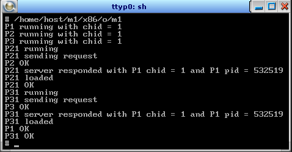

1. [Запуск и организация взаимодействия параллельных процессов](#lab1)

## 1. Запуск и организация взаимодействия параллельных процессов 

### Задание
Разработать приложение, состоящее из пяти взаимодействующих процессов. Требуется написать три программных модуля – М1, М2, М3. На базе модуля М1 из shell запускается стартовый процесс Р1(М1).

Процесс Р1 создаёт свой канал и, используя функцию семейства spawn*(), запускает процессы Р2(М2) и Р3(М2), передавая им в качестве аргумента chid своего канала, затем переходит в состояние приёма сообщений по своему каналу.

Процесс Р2 создаёт свой канал и, используя функцию семейства spawn*(), запускает процесс Р4(М3), передавая в качестве аргумента chid своего канала, затем переходит в состояние приёма сообщений по созданному каналу.

Процесс Р3 создаёт свой канал и, используя функцию семейства spawn*(), запускает процесс Р5(М3), передавая в качестве аргумента chid своего канала, затем переходит в состояние приёма сообщений по созданному каналу.

Процесс Р?(М3) устанавливает соединение c каналом родительского процесса Р?(М2) и посылает запрос на получение pid процесса Р1 и chid его канала, затем, после получения ответа (pid и chid), устанавливает соединение с каналом процесса Р1 и посылает ему сообщение «Р? loaded». После получения ответа выводит на экран «Р? ОК» и терминируется.

Процесс Р?(М2) после ответа на запрос процесса Р?(М3) выводит на терминал «Р? ОК» и терминируется.

Процесс Р1, получив сообщение от процесса Р1 или Р5, выводит его на экран и посылает ответ. После взаимодействия с Р1 и Р5 процесс Р1 выводит на экран «Р1 ОК» и терминируется.

### Порядок выполнения приложения
Стартовый процесс P1 запускается в терминале целевой системы QNX, установленной на виртуальной машине. В процессе P1 создаётся канал. Далее, из процесса P1 при помощи функции spawnl() запускаются дочерние процессы P2 и P3 без блокировки выполнения родительского процесса P1. При запуске P2 и P3, в эти дочерние процессы передаётся chid процесса P1. Процесс P1 ожидает сообщения от процессов P21 и P31, P1 входит в состояние ожидания сообщения с помощью функции MsgReceive(), получив сообщение, процесс P1 сообщает ответ о получении при помощи функции MsgReply(). После получения сообщении от P21 и P31 процесс P1 терминируется. 

Процесс P2 создаёт канал, затем создаёт дочерний процесс P21 и передает ему id созданного канала. 

Процесс P21 создаёт канал, затем устанавливает соединение с каналом родительского процесса – процесса P2 – при помощи функции ConnectAttach() и отправляет сообщение с функцией MsgSend(). Процесс P21 блокируется до тех пор пока не получит ответ о получении от процесса P2. Процесс P2 получив сообщение при помощи функции MsgReceive() от P21 отправляет ответ с значениями pid и chid процесса P1 при помощи функции MsgReply(). После получения ответа процесс P21 разблокируются, процесс P2 выводит сообщение в консоль «P2 OK» и терминируется. 

После, процесс P21 устанавливает соединение с каналом процесса P1 и отправляет сообщение «P21 loaded». После получения ответа от процесса P1, процесс P21 выводит сообщение «P21 OK» и терминируется.

Порядок выполнения процесса P3 аналогичен процессу P2 (процесс P3 создаёт свой дочерний процесс P31 и т.д.).

Процесс P1, получив сообщение от процессов P21 и P31, отправляет ответное сообщение. Затем выводит в терминал «P1 OK» и терминируется. 

Процессу P1 соответствует модуль M1, процессам P2 и P3 – модуль M2, процессам P21 и P31 – модуль M3.

